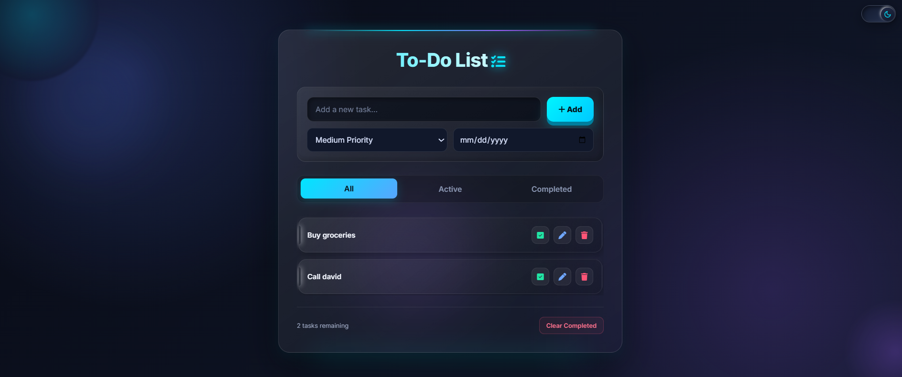

# ✅ To-Do List Web Application

A modern, responsive, and interactive **To-Do List Web Application** built with **HTML5, CSS3, and Vanilla JavaScript**.

This project is designed to provide a simple and practical way to create, organize, prioritize, and manage daily tasks through a clean and user-friendly interface.

---

## 🌐 Live Demo

🔗 **[View Live Demo](https://muhammadahmad152.github.io/to-do-list/)**

---

## 📸 Project Preview



---

## ✨ Features

- ➕ **Add Tasks:** Quickly add new daily tasks to your list.
- ✏️ **Edit Tasks:** Easily update or modify existing task details.
- ✅ **Complete Tasks:** Mark tasks as completed to track progress.
- 🗑️ **Delete Tasks:** Remove individual tasks you no longer need.
- 🎯 **Priority Management:** Assign priority levels to keep critical tasks focused.
- 📅 **Due Dates:** Set target dates to stay on schedule.
- 🔎 **Smart Filtering:** View tasks by category:
  - All Tasks
  - Active Tasks
  - Completed Tasks
- 🧹 **Bulk Cleanup:** Clear all completed tasks with a single click.
- 📊 **Task Statistics:** Get instant overview stats on active and completed items.
- 🌙 **Dark Mode UI:** Sleek modern dark-themed interface designed to reduce eye strain.
- ⚡ **Dynamic UI:** Smooth real-time interactive DOM updates.
- 📱 **Fully Responsive:** Seamlessly adapted for mobile, tablet, and desktop screens.

---

## 🛠️ Technologies Used

### Frontend & Core
- **HTML5:** Semantic markup structure
- **CSS3:** Flexbox, CSS Grid, custom properties (variables), animations, and responsive layout design
- **JavaScript (ES6+):** Vanilla JS for core logic and state handling

### Concepts & Techniques Applied
- Dynamic DOM Manipulation
- Event Handling & Delegation
- Modern JavaScript (Arrays, Objects, Functions)
- Dynamic Content Rendering & State Management
- Form Input Handling & Validation
- Responsive Web Design (RWD)

---

## 📂 Project Structure

```text
to-do-list/
│
├── index.html       # Application layout and structure
├── style.css        # Custom styles, theme, and responsiveness
├── script.js        # Core JavaScript application logic
├── preview.png      # Application screenshot for preview
└── README.md        # Project documentation
